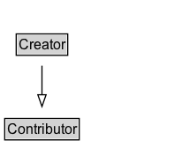

# Creator

## Diagram

=== "SVG (interactive)"

    <!-- Generated by graphviz version 14.0.2 (20251019.1705)
     -->
    <!-- Pages: 1 -->
    <svg width="155pt" height="132pt"
     viewBox="0.00 0.00 155.00 132.00" xmlns="http://www.w3.org/2000/svg" xmlns:xlink="http://www.w3.org/1999/xlink">
    <g id="graph0" class="graph" transform="scale(1 1) rotate(0) translate(4 128)">
    <polygon fill="white" stroke="none" points="-4,4 -4,-128 150.62,-128 150.62,4 -4,4"/>
    <g id="clust2" class="cluster">
    <title>cluster_associated</title>
    </g>
    <!-- Creator -->
    <g id="node1" class="node">
    <title>Creator</title>
    <g id="a_node1"><a xlink:href="../Creator" xlink:title="&lt;TABLE&gt;">
    <polygon fill="lightgray" stroke="none" points="10.75,-81.88 10.75,-98.12 52.5,-98.12 52.5,-81.88 10.75,-81.88"/>
    <text xml:space="preserve" text-anchor="start" x="11.75" y="-85.72" font-family="Arial" font-size="12.00">Creator</text>
    <polygon fill="none" stroke="black" points="9.75,-80.88 9.75,-99.12 53.5,-99.12 53.5,-80.88 9.75,-80.88"/>
    </a>
    </g>
    </g>
    <!-- Contributor -->
    <g id="node3" class="node">
    <title>Contributor</title>
    <g id="a_node3"><a xlink:href="../Contributor" xlink:title="&lt;TABLE&gt;">
    <polygon fill="lightgray" stroke="none" points="1,-9.88 1,-26.12 62.25,-26.12 62.25,-9.88 1,-9.88"/>
    <text xml:space="preserve" text-anchor="start" x="2" y="-13.72" font-family="Arial" font-size="12.00">Contributor</text>
    <polygon fill="none" stroke="black" points="0,-8.88 0,-27.12 63.25,-27.12 63.25,-8.88 0,-8.88"/>
    </a>
    </g>
    </g>
    <!-- Creator&#45;&gt;Contributor -->
    <g id="edge1" class="edge">
    <title>Creator&#45;&gt;Contributor</title>
    <path fill="none" stroke="black" d="M31.62,-72.05C31.62,-64.57 31.62,-55.58 31.62,-47.14"/>
    <polygon fill="none" stroke="black" points="35.13,-47.3 31.63,-37.3 28.13,-47.3 35.13,-47.3"/>
    </g>
    <!-- Invis -->
    </g>
    </svg>

=== "PNG"

    

## Formalization for Creator

| Property | Constraint |
|----------|------------|
| subClassOf | [Contributor](Contributor.md) |

## Other annotations

| Property | Value |
|----------|-------|
| [definition](https://w3id.org/citydata/imported//definition) | Role with the function of creating a resource. The Agent assigned to this role is associated with a Create Activity |

