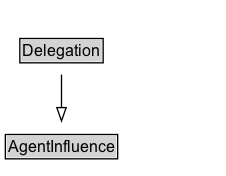

# Delegation

## Diagram

=== "SVG (interactive)"

    <!-- Generated by graphviz version 14.0.2 (20251019.1705)
     -->
    <!-- Pages: 1 -->
    <svg width="169pt" height="132pt"
     viewBox="0.00 0.00 169.00 132.00" xmlns="http://www.w3.org/2000/svg" xmlns:xlink="http://www.w3.org/1999/xlink">
    <g id="graph0" class="graph" transform="scale(1 1) rotate(0) translate(4 128)">
    <polygon fill="white" stroke="none" points="-4,4 -4,-128 165.12,-128 165.12,4 -4,4"/>
    <g id="clust2" class="cluster">
    <title>cluster_associated</title>
    </g>
    <!-- Delegation -->
    <g id="node1" class="node">
    <title>Delegation</title>
    <g id="a_node1"><a xlink:href="../Delegation" xlink:title="&lt;TABLE&gt;">
    <polygon fill="lightgray" stroke="none" points="11.88,-81.88 11.88,-98.12 72.38,-98.12 72.38,-81.88 11.88,-81.88"/>
    <text xml:space="preserve" text-anchor="start" x="12.88" y="-85.72" font-family="Arial" font-size="12.00">Delegation</text>
    <polygon fill="none" stroke="black" points="10.88,-80.88 10.88,-99.12 73.38,-99.12 73.38,-80.88 10.88,-80.88"/>
    </a>
    </g>
    </g>
    <!-- AgentInfluence -->
    <g id="node3" class="node">
    <title>AgentInfluence</title>
    <g id="a_node3"><a xlink:href="../AgentInfluence" xlink:title="&lt;TABLE&gt;">
    <polygon fill="lightgray" stroke="none" points="1,-9.88 1,-26.12 83.25,-26.12 83.25,-9.88 1,-9.88"/>
    <text xml:space="preserve" text-anchor="start" x="2" y="-13.72" font-family="Arial" font-size="12.00">AgentInfluence</text>
    <polygon fill="none" stroke="black" points="0,-8.88 0,-27.12 84.25,-27.12 84.25,-8.88 0,-8.88"/>
    </a>
    </g>
    </g>
    <!-- Delegation&#45;&gt;AgentInfluence -->
    <g id="edge1" class="edge">
    <title>Delegation&#45;&gt;AgentInfluence</title>
    <path fill="none" stroke="black" d="M42.12,-72.05C42.12,-64.57 42.12,-55.58 42.12,-47.14"/>
    <polygon fill="none" stroke="black" points="45.63,-47.3 42.13,-37.3 38.63,-47.3 45.63,-47.3"/>
    </g>
    <!-- Invis -->
    </g>
    </svg>

=== "PNG"

    

## Formalization for Delegation

| Property | Constraint |
|----------|------------|
| subClassOf | [AgentInfluence](AgentInfluence.md) |

## Other annotations

| Property | Value |
|----------|-------|
| [category](https://w3id.org/citydata/imported//category) | qualified |
| [component](https://w3id.org/citydata/imported//component) | agents-responsibility |
| [definition](https://w3id.org/citydata/imported//definition) | Delegation is the assignment of authority and responsibility to an agent (by itself or by another agent) to carry out a specific activity as a delegate or representative, while the agent it acts on behalf of retains some responsibility for the outcome of the delegated work.

For example, a student acted on behalf of his supervisor, who acted on behalf of the department chair, who acted on behalf of the university; all those agents are responsible in some way for the activity that took place but we do not say explicitly who bears responsibility and to what degree. |
| [dm](https://w3id.org/citydata/imported//dm) | http://www.w3.org/TR/2013/REC-prov-dm-20130430/#term-delegation |
| [n](https://w3id.org/citydata/imported//n) | http://www.w3.org/TR/2013/REC-prov-n-20130430/#expression-delegation |

