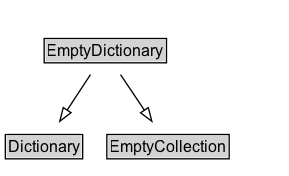

# EmptyDictionary

## Diagram

=== "SVG (interactive)"

    <!-- Generated by graphviz version 14.0.2 (20251019.1705)
     -->
    <!-- Pages: 1 -->
    <svg width="217pt" height="132pt"
     viewBox="0.00 0.00 217.00 132.00" xmlns="http://www.w3.org/2000/svg" xmlns:xlink="http://www.w3.org/1999/xlink">
    <g id="graph0" class="graph" transform="scale(1 1) rotate(0) translate(4 128)">
    <polygon fill="white" stroke="none" points="-4,4 -4,-128 213,-128 213,4 -4,4"/>
    <g id="clust2" class="cluster">
    <title>cluster_associated</title>
    </g>
    <!-- EmptyDictionary -->
    <g id="node1" class="node">
    <title>EmptyDictionary</title>
    <g id="a_node1"><a xlink:href="../EmptyDictionary" xlink:title="&lt;TABLE&gt;">
    <polygon fill="lightgray" stroke="none" points="30.12,-81.88 30.12,-98.12 119.88,-98.12 119.88,-81.88 30.12,-81.88"/>
    <text xml:space="preserve" text-anchor="start" x="31.12" y="-85.72" font-family="Arial" font-size="12.00">EmptyDictionary</text>
    <polygon fill="none" stroke="black" points="29.12,-80.88 29.12,-99.12 120.88,-99.12 120.88,-80.88 29.12,-80.88"/>
    </a>
    </g>
    </g>
    <!-- Dictionary -->
    <g id="node3" class="node">
    <title>Dictionary</title>
    <g id="a_node3"><a xlink:href="../Dictionary" xlink:title="&lt;TABLE&gt;">
    <polygon fill="lightgray" stroke="none" points="1,-9.88 1,-26.12 57,-26.12 57,-9.88 1,-9.88"/>
    <text xml:space="preserve" text-anchor="start" x="2" y="-13.72" font-family="Arial" font-size="12.00">Dictionary</text>
    <polygon fill="none" stroke="black" points="0,-8.88 0,-27.12 58,-27.12 58,-8.88 0,-8.88"/>
    </a>
    </g>
    </g>
    <!-- EmptyDictionary&#45;&gt;Dictionary -->
    <g id="edge1" class="edge">
    <title>EmptyDictionary&#45;&gt;Dictionary</title>
    <path fill="none" stroke="black" d="M63.86,-72.05C58.61,-64.06 52.22,-54.33 46.35,-45.4"/>
    <polygon fill="none" stroke="black" points="49.28,-43.49 40.86,-37.05 43.43,-47.33 49.28,-43.49"/>
    </g>
    <!-- EmptyCollection -->
    <g id="node4" class="node">
    <title>EmptyCollection</title>
    <g id="a_node4"><a xlink:href="../EmptyCollection" xlink:title="&lt;TABLE&gt;">
    <polygon fill="lightgray" stroke="none" points="77.12,-9.88 77.12,-26.12 166.88,-26.12 166.88,-9.88 77.12,-9.88"/>
    <text xml:space="preserve" text-anchor="start" x="78.12" y="-13.72" font-family="Arial" font-size="12.00">EmptyCollection</text>
    <polygon fill="none" stroke="black" points="76.12,-8.88 76.12,-27.12 167.88,-27.12 167.88,-8.88 76.12,-8.88"/>
    </a>
    </g>
    </g>
    <!-- EmptyDictionary&#45;&gt;EmptyCollection -->
    <g id="edge2" class="edge">
    <title>EmptyDictionary&#45;&gt;EmptyCollection</title>
    <path fill="none" stroke="black" d="M86.38,-72.05C91.8,-63.97 98.42,-54.12 104.47,-45.11"/>
    <polygon fill="none" stroke="black" points="107.22,-47.3 109.88,-37.05 101.4,-43.4 107.22,-47.3"/>
    </g>
    <!-- Invis -->
    </g>
    </svg>

=== "PNG"

    

## Formalization for EmptyDictionary

| Property | Constraint |
|----------|------------|
| subClassOf | [Dictionary](Dictionary.md) |
| subClassOf | [EmptyCollection](EmptyCollection.md) |

## Other annotations

| Property | Value |
|----------|-------|
| [category](https://w3id.org/citydata/imported//category) | collections |
| [component](https://w3id.org/citydata/imported//component) | collections |
| [constraints](https://w3id.org/citydata/imported//constraints) | http://www.w3.org/TR/2013/NOTE-prov-dictionary-20130430/#dictionary-constraints |
| [definition](https://w3id.org/citydata/imported//definition) | An empty dictionary (i.e. has no members). |
| [dm](https://w3id.org/citydata/imported//dm) | http://www.w3.org/TR/2013/NOTE-prov-dictionary-20130430/#dictionary-conceptual-definition |
| [n](https://w3id.org/citydata/imported//n) | http://www.w3.org/TR/2013/NOTE-prov-dictionary-20130430/#expression-dictionary |

