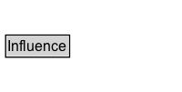

# Influence

## Diagram

=== "SVG (interactive)"

    <!-- Generated by graphviz version 14.0.2 (20251019.1705)
     -->
    <!-- Pages: 1 -->
    <svg width="150pt" height="76pt"
     viewBox="0.00 0.00 150.00 76.00" xmlns="http://www.w3.org/2000/svg" xmlns:xlink="http://www.w3.org/1999/xlink">
    <g id="graph0" class="graph" transform="scale(1 1) rotate(0) translate(4 72)">
    <polygon fill="white" stroke="none" points="-4,4 -4,-72 146,-72 146,4 -4,4"/>
    <g id="clust2" class="cluster">
    <title>cluster_associated</title>
    </g>
    <!-- Influence -->
    <g id="node1" class="node">
    <title>Influence</title>
    <g id="a_node1"><a xlink:href="../Influence" xlink:title="&lt;TABLE&gt;">
    <polygon fill="lightgray" stroke="none" points="1.62,-25.88 1.62,-42.12 52.38,-42.12 52.38,-25.88 1.62,-25.88"/>
    <text xml:space="preserve" text-anchor="start" x="2.62" y="-29.73" font-family="Arial" font-size="12.00">Influence</text>
    <polygon fill="none" stroke="black" points="0.62,-24.88 0.62,-43.12 53.38,-43.12 53.38,-24.88 0.62,-24.88"/>
    </a>
    </g>
    </g>
    <!-- Invis -->
    </g>
    </svg>

=== "PNG"

    

## Specializations of Influence

| Class | Description |
|-------|-------------|
| [Activity Influence](ActivityInfluence.md) |  |
| [Agent Influence](AgentInfluence.md) |  |
| [Association](Association.md) |  |
| [Attribution](Attribution.md) |  |
| [Communication](Communication.md) |  |
| [Delegation](Delegation.md) |  |
| [Derivation](Derivation.md) |  |
| [End](End.md) |  |
| [Entity Influence](EntityInfluence.md) |  |
| [Generation](Generation.md) |  |
| [Insertion](Insertion.md) |  |
| [Invalidation](Invalidation.md) |  |
| [Primary Source](PrimarySource.md) |  |
| [Quotation](Quotation.md) |  |
| [Removal](Removal.md) |  |
| [Revision](Revision.md) |  |
| [Start](Start.md) |  |
| [Usage](Usage.md) |  |

## Other annotations

| Property | Value |
|----------|-------|
| [category](https://w3id.org/citydata/imported//category) | qualified |
| [component](https://w3id.org/citydata/imported//component) | derivations |
| [definition](https://w3id.org/citydata/imported//definition) | Influence is the capacity of an entity, activity, or agent to have an effect on the character, development, or behavior of another by means of usage, start, end, generation, invalidation, communication, derivation, attribution, association, or delegation. |
| [dm](https://w3id.org/citydata/imported//dm) | http://www.w3.org/TR/2013/REC-prov-dm-20130430/#term-influence |
| [n](https://w3id.org/citydata/imported//n) | http://www.w3.org/TR/2013/REC-prov-n-20130430/#expression-influence |

