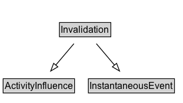

# Invalidation

## Diagram

=== "SVG (interactive)"

    <!-- Generated by graphviz version 14.0.2 (20251019.1705)
     -->
    <!-- Pages: 1 -->
    <svg width="234pt" height="132pt"
     viewBox="0.00 0.00 234.00 132.00" xmlns="http://www.w3.org/2000/svg" xmlns:xlink="http://www.w3.org/1999/xlink">
    <g id="graph0" class="graph" transform="scale(1 1) rotate(0) translate(4 128)">
    <polygon fill="white" stroke="none" points="-4,4 -4,-128 229.5,-128 229.5,4 -4,4"/>
    <g id="clust2" class="cluster">
    <title>cluster_associated</title>
    </g>
    <!-- Invalidation -->
    <g id="node1" class="node">
    <title>Invalidation</title>
    <g id="a_node1"><a xlink:href="../Invalidation" xlink:title="&lt;TABLE&gt;">
    <polygon fill="lightgray" stroke="none" points="72.75,-81.88 72.75,-98.12 136.25,-98.12 136.25,-81.88 72.75,-81.88"/>
    <text xml:space="preserve" text-anchor="start" x="73.75" y="-85.72" font-family="Arial" font-size="12.00">Invalidation</text>
    <polygon fill="none" stroke="black" points="71.75,-80.88 71.75,-99.12 137.25,-99.12 137.25,-80.88 71.75,-80.88"/>
    </a>
    </g>
    </g>
    <!-- ActivityInfluence -->
    <g id="node3" class="node">
    <title>ActivityInfluence</title>
    <g id="a_node3"><a xlink:href="../ActivityInfluence" xlink:title="&lt;TABLE&gt;">
    <polygon fill="lightgray" stroke="none" points="1,-9.88 1,-26.12 90,-26.12 90,-9.88 1,-9.88"/>
    <text xml:space="preserve" text-anchor="start" x="2" y="-13.72" font-family="Arial" font-size="12.00">ActivityInfluence</text>
    <polygon fill="none" stroke="black" points="0,-8.88 0,-27.12 91,-27.12 91,-8.88 0,-8.88"/>
    </a>
    </g>
    </g>
    <!-- Invalidation&#45;&gt;ActivityInfluence -->
    <g id="edge1" class="edge">
    <title>Invalidation&#45;&gt;ActivityInfluence</title>
    <path fill="none" stroke="black" d="M90.22,-72.05C83.26,-63.8 74.75,-53.7 67.02,-44.54"/>
    <polygon fill="none" stroke="black" points="69.75,-42.34 60.63,-36.95 64.39,-46.85 69.75,-42.34"/>
    </g>
    <!-- InstantaneousEvent -->
    <g id="node4" class="node">
    <title>InstantaneousEvent</title>
    <g id="a_node4"><a xlink:href="../InstantaneousEvent" xlink:title="&lt;TABLE&gt;">
    <polygon fill="lightgray" stroke="none" points="109.62,-9.88 109.62,-26.12 217.38,-26.12 217.38,-9.88 109.62,-9.88"/>
    <text xml:space="preserve" text-anchor="start" x="110.62" y="-13.72" font-family="Arial" font-size="12.00">InstantaneousEvent</text>
    <polygon fill="none" stroke="black" points="108.62,-8.88 108.62,-27.12 218.38,-27.12 218.38,-8.88 108.62,-8.88"/>
    </a>
    </g>
    </g>
    <!-- Invalidation&#45;&gt;InstantaneousEvent -->
    <g id="edge2" class="edge">
    <title>Invalidation&#45;&gt;InstantaneousEvent</title>
    <path fill="none" stroke="black" d="M118.78,-72.05C125.74,-63.8 134.25,-53.7 141.98,-44.54"/>
    <polygon fill="none" stroke="black" points="144.61,-46.85 148.37,-36.95 139.25,-42.34 144.61,-46.85"/>
    </g>
    <!-- Invis -->
    </g>
    </svg>

=== "PNG"

    

## Formalization for Invalidation

| Property | Constraint |
|----------|------------|
| subClassOf | [ActivityInfluence](ActivityInfluence.md) |
| subClassOf | [InstantaneousEvent](InstantaneousEvent.md) |

## Other annotations

| Property | Value |
|----------|-------|
| [category](https://w3id.org/citydata/imported//category) | qualified |
| [component](https://w3id.org/citydata/imported//component) | entities-activities |
| [constraints](https://w3id.org/citydata/imported//constraints) | http://www.w3.org/TR/2013/REC-prov-constraints-20130430/#prov-dm-constraints-fig |
| [definition](https://w3id.org/citydata/imported//definition) | Invalidation is the start of the destruction, cessation, or expiry of an existing entity by an activity. The entity is no longer available for use (or further invalidation) after invalidation. Any generation or usage of an entity precedes its invalidation. |
| [dm](https://w3id.org/citydata/imported//dm) | http://www.w3.org/TR/2013/REC-prov-dm-20130430/#term-Invalidation |
| [n](https://w3id.org/citydata/imported//n) | http://www.w3.org/TR/2013/REC-prov-n-20130430/#expression-Invalidation |

