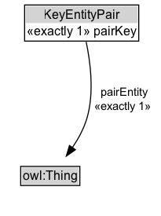

# KeyEntityPair

## Diagram

=== "SVG (interactive)"

    <!-- Generated by graphviz version 14.0.2 (20251019.1705)
     -->
    <!-- Pages: 1 -->
    <svg width="154pt" height="206pt"
     viewBox="0.00 0.00 154.00 206.00" xmlns="http://www.w3.org/2000/svg" xmlns:xlink="http://www.w3.org/1999/xlink">
    <g id="graph0" class="graph" transform="scale(1 1) rotate(0) translate(4 202)">
    <polygon fill="white" stroke="none" points="-4,4 -4,-202 150.01,-202 150.01,4 -4,4"/>
    <g id="clust2" class="cluster">
    <title>cluster_associated</title>
    </g>
    <!-- KeyEntityPair -->
    <g id="node1" class="node">
    <title>KeyEntityPair</title>
    <g id="a_node1"><a xlink:href="../KeyEntityPair" xlink:title="&lt;TABLE&gt;">
    <polygon fill="lightgray" stroke="none" points="20.5,-180 20.5,-196.25 127.5,-196.25 127.5,-180 20.5,-180"/>
    <text xml:space="preserve" text-anchor="start" x="37.62" y="-183.85" font-family="Arial" font-size="12.00">KeyEntityPair</text>
    <text xml:space="preserve" text-anchor="start" x="21.5" y="-167.6" font-family="Arial" font-size="12.00">«exactly 1» pairKey</text>
    <polygon fill="none" stroke="black" points="19.5,-162.75 19.5,-197.25 128.5,-197.25 128.5,-162.75 19.5,-162.75"/>
    </a>
    </g>
    </g>
    <!-- Invis -->
    <!-- KeyEntityPair&#45;&gt;Invis -->
    <!-- owl_Thing -->
    <g id="node3" class="node">
    <title>owl_Thing</title>
    <g id="a_node3"><a xlink:href="https://w3id.org/citydata/imported/owl/Thing" xlink:title="&lt;TABLE&gt;">
    <polygon fill="lightgray" stroke="none" points="16.75,-25.88 16.75,-42.12 71.25,-42.12 71.25,-25.88 16.75,-25.88"/>
    <text xml:space="preserve" text-anchor="start" x="17.75" y="-29.73" font-family="Arial" font-size="12.00">owl:Thing</text>
    <polygon fill="none" stroke="black" points="15.75,-24.88 15.75,-43.12 72.25,-43.12 72.25,-24.88 15.75,-24.88"/>
    </a>
    </g>
    </g>
    <!-- KeyEntityPair&#45;&gt;owl_Thing -->
    <g id="edge3" class="edge">
    <title>KeyEntityPair&#45;&gt;owl_Thing</title>
    <path fill="none" stroke="black" d="M78.29,-162.02C82.18,-143.63 86.28,-113.61 79,-89 76.09,-79.14 70.75,-69.4 65.1,-60.96"/>
    <polygon fill="black" stroke="black" points="68.02,-59.02 59.34,-52.94 62.34,-63.11 68.02,-59.02"/>
    <text xml:space="preserve" text-anchor="middle" x="114.51" y="-110.05" font-family="Arial" font-size="11.00"> pairEntity </text>
    <text xml:space="preserve" text-anchor="middle" x="114.51" y="-96.55" font-family="Arial" font-size="11.00"> «exactly 1» &#160;</text>
    </g>
    <!-- Invis&#45;&gt;owl_Thing -->
    </g>
    </svg>

=== "PNG"

    

## Formalization for KeyEntityPair

| Property | Constraint |
|----------|------------|
| [pairEntity](https://w3id.org/citydata/imported//pairEntity) | exactly 1 |
| [pairKey](https://w3id.org/citydata/imported//pairKey) | exactly 1 |

## Other annotations

| Property | Value |
|----------|-------|
| [category](https://w3id.org/citydata/imported//category) | collections |
| [component](https://w3id.org/citydata/imported//component) | collections |
| [constraints](https://w3id.org/citydata/imported//constraints) | http://www.w3.org/TR/2013/NOTE-prov-dictionary-20130430/#dictionary-constraints |
| [definition](https://w3id.org/citydata/imported//definition) | A key-entity pair. Part of a prov:Dictionary through prov:hadDictionaryMember. The key is any RDF Literal, the value is a prov:Entity. |
| [dm](https://w3id.org/citydata/imported//dm) | http://www.w3.org/TR/2013/NOTE-prov-dictionary-20130430/#term-dictionary-membership |
| [n](https://w3id.org/citydata/imported//n) | http://www.w3.org/TR/2013/NOTE-prov-dictionary-20130430/#expression-dictionary-membership |

