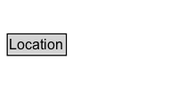

# Location

## Diagram

=== "SVG (interactive)"

    <!-- Generated by graphviz version 14.0.2 (20251019.1705)
     -->
    <!-- Pages: 1 -->
    <svg width="150pt" height="76pt"
     viewBox="0.00 0.00 150.00 76.00" xmlns="http://www.w3.org/2000/svg" xmlns:xlink="http://www.w3.org/1999/xlink">
    <g id="graph0" class="graph" transform="scale(1 1) rotate(0) translate(4 72)">
    <polygon fill="white" stroke="none" points="-4,4 -4,-72 146,-72 146,4 -4,4"/>
    <g id="clust2" class="cluster">
    <title>cluster_associated</title>
    </g>
    <!-- Location -->
    <g id="node1" class="node">
    <title>Location</title>
    <g id="a_node1"><a xlink:href="../Location" xlink:title="&lt;TABLE&gt;">
    <polygon fill="lightgray" stroke="none" points="3.12,-25.88 3.12,-42.12 50.88,-42.12 50.88,-25.88 3.12,-25.88"/>
    <text xml:space="preserve" text-anchor="start" x="4.12" y="-29.73" font-family="Arial" font-size="12.00">Location</text>
    <polygon fill="none" stroke="black" points="2.12,-24.88 2.12,-43.12 51.88,-43.12 51.88,-24.88 2.12,-24.88"/>
    </a>
    </g>
    </g>
    <!-- Invis -->
    </g>
    </svg>

=== "PNG"

    

## Other annotations

| Property | Value |
|----------|-------|
| [category](https://w3id.org/citydata/imported//category) | expanded |
| [definition](https://w3id.org/citydata/imported//definition) | A location can be an identifiable geographic place (ISO 19112), but it can also be a non-geographic place such as a directory, row, or column. As such, there are numerous ways in which location can be expressed, such as by a coordinate, address, landmark, and so forth. |
| [dm](https://w3id.org/citydata/imported//dm) | http://www.w3.org/TR/2013/REC-prov-dm-20130430/#term-attribute-location |
| [n](https://w3id.org/citydata/imported//n) | http://www.w3.org/TR/2013/REC-prov-n-20130430/#expression-attribute |

