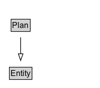

# Plan

## Diagram

=== "SVG (interactive)"

    <!-- Generated by graphviz version 14.0.2 (20251019.1705)
     -->
    <!-- Pages: 1 -->
    <svg width="150pt" height="132pt"
     viewBox="0.00 0.00 150.00 132.00" xmlns="http://www.w3.org/2000/svg" xmlns:xlink="http://www.w3.org/1999/xlink">
    <g id="graph0" class="graph" transform="scale(1 1) rotate(0) translate(4 128)">
    <polygon fill="white" stroke="none" points="-4,4 -4,-128 146,-128 146,4 -4,4"/>
    <g id="clust2" class="cluster">
    <title>cluster_associated</title>
    </g>
    <!-- Plan -->
    <g id="node1" class="node">
    <title>Plan</title>
    <g id="a_node1"><a xlink:href="../Plan" xlink:title="&lt;TABLE&gt;">
    <polygon fill="lightgray" stroke="none" points="13.62,-81.88 13.62,-98.12 40.38,-98.12 40.38,-81.88 13.62,-81.88"/>
    <text xml:space="preserve" text-anchor="start" x="14.62" y="-85.72" font-family="Arial" font-size="12.00">Plan</text>
    <polygon fill="none" stroke="black" points="12.62,-80.88 12.62,-99.12 41.38,-99.12 41.38,-80.88 12.62,-80.88"/>
    </a>
    </g>
    </g>
    <!-- Entity -->
    <g id="node3" class="node">
    <title>Entity</title>
    <g id="a_node3"><a xlink:href="../Entity" xlink:title="&lt;TABLE&gt;">
    <polygon fill="lightgray" stroke="none" points="11,-9.88 11,-26.12 43,-26.12 43,-9.88 11,-9.88"/>
    <text xml:space="preserve" text-anchor="start" x="12" y="-13.72" font-family="Arial" font-size="12.00">Entity</text>
    <polygon fill="none" stroke="black" points="10,-8.88 10,-27.12 44,-27.12 44,-8.88 10,-8.88"/>
    </a>
    </g>
    </g>
    <!-- Plan&#45;&gt;Entity -->
    <g id="edge1" class="edge">
    <title>Plan&#45;&gt;Entity</title>
    <path fill="none" stroke="black" d="M27,-72.05C27,-64.57 27,-55.58 27,-47.14"/>
    <polygon fill="none" stroke="black" points="30.5,-47.3 27,-37.3 23.5,-47.3 30.5,-47.3"/>
    </g>
    <!-- Invis -->
    </g>
    </svg>

=== "PNG"

    

## Formalization for Plan

| Property | Constraint |
|----------|------------|
| subClassOf | [Entity](Entity.md) |

## Other annotations

| Property | Value |
|----------|-------|
| [category](https://w3id.org/citydata/imported//category) | expanded |
| [category](https://w3id.org/citydata/imported//category) | qualified |
| [component](https://w3id.org/citydata/imported//component) | agents-responsibility |
| [definition](https://w3id.org/citydata/imported//definition) | A plan is an entity that represents a set of actions or steps intended by one or more agents to achieve some goals. |
| [dm](https://w3id.org/citydata/imported//dm) | http://www.w3.org/TR/2013/REC-prov-dm-20130430/#term-Association |
| [n](https://w3id.org/citydata/imported//n) | http://www.w3.org/TR/2013/REC-prov-n-20130430/#expression-Association |

