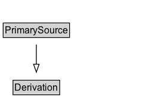

# PrimarySource

## Diagram

=== "SVG (interactive)"

    <!-- Generated by graphviz version 14.0.2 (20251019.1705)
     -->
    <!-- Pages: 1 -->
    <svg width="180pt" height="132pt"
     viewBox="0.00 0.00 180.00 132.00" xmlns="http://www.w3.org/2000/svg" xmlns:xlink="http://www.w3.org/1999/xlink">
    <g id="graph0" class="graph" transform="scale(1 1) rotate(0) translate(4 128)">
    <polygon fill="white" stroke="none" points="-4,4 -4,-128 175.75,-128 175.75,4 -4,4"/>
    <g id="clust2" class="cluster">
    <title>cluster_associated</title>
    </g>
    <!-- PrimarySource -->
    <g id="node1" class="node">
    <title>PrimarySource</title>
    <g id="a_node1"><a xlink:href="../PrimarySource" xlink:title="&lt;TABLE&gt;">
    <polygon fill="lightgray" stroke="none" points="1,-81.88 1,-98.12 82.5,-98.12 82.5,-81.88 1,-81.88"/>
    <text xml:space="preserve" text-anchor="start" x="2" y="-85.72" font-family="Arial" font-size="12.00">PrimarySource</text>
    <polygon fill="none" stroke="black" points="0,-80.88 0,-99.12 83.5,-99.12 83.5,-80.88 0,-80.88"/>
    </a>
    </g>
    </g>
    <!-- Derivation -->
    <g id="node3" class="node">
    <title>Derivation</title>
    <g id="a_node3"><a xlink:href="../Derivation" xlink:title="&lt;TABLE&gt;">
    <polygon fill="lightgray" stroke="none" points="13.38,-9.88 13.38,-26.12 70.12,-26.12 70.12,-9.88 13.38,-9.88"/>
    <text xml:space="preserve" text-anchor="start" x="14.38" y="-13.72" font-family="Arial" font-size="12.00">Derivation</text>
    <polygon fill="none" stroke="black" points="12.38,-8.88 12.38,-27.12 71.12,-27.12 71.12,-8.88 12.38,-8.88"/>
    </a>
    </g>
    </g>
    <!-- PrimarySource&#45;&gt;Derivation -->
    <g id="edge1" class="edge">
    <title>PrimarySource&#45;&gt;Derivation</title>
    <path fill="none" stroke="black" d="M41.75,-72.05C41.75,-64.57 41.75,-55.58 41.75,-47.14"/>
    <polygon fill="none" stroke="black" points="45.25,-47.3 41.75,-37.3 38.25,-47.3 45.25,-47.3"/>
    </g>
    <!-- Invis -->
    </g>
    </svg>

=== "PNG"

    

## Formalization for PrimarySource

| Property | Constraint |
|----------|------------|
| subClassOf | [Derivation](Derivation.md) |

## Other annotations

| Property | Value |
|----------|-------|
| [category](https://w3id.org/citydata/imported//category) | qualified |
| [component](https://w3id.org/citydata/imported//component) | derivations |
| [definition](https://w3id.org/citydata/imported//definition) | A primary source for a topic refers to something produced by some agent with direct experience and knowledge about the topic, at the time of the topic's study, without benefit from hindsight.

Because of the directness of primary sources, they 'speak for themselves' in ways that cannot be captured through the filter of secondary sources. As such, it is important for secondary sources to reference those primary sources from which they were derived, so that their reliability can be investigated.

A primary source relation is a particular case of derivation of secondary materials from their primary sources. It is recognized that the determination of primary sources can be up to interpretation, and should be done according to conventions accepted within the application's domain. |
| [dm](https://w3id.org/citydata/imported//dm) | http://www.w3.org/TR/2013/REC-prov-dm-20130430/#term-primary-source |
| [n](https://w3id.org/citydata/imported//n) | http://www.w3.org/TR/2013/REC-prov-n-20130430/#expression-original-source |

