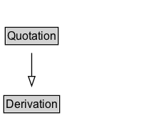

# Quotation

## Diagram

=== "SVG (interactive)"

    <!-- Generated by graphviz version 14.0.2 (20251019.1705)
     -->
    <!-- Pages: 1 -->
    <svg width="153pt" height="132pt"
     viewBox="0.00 0.00 153.00 132.00" xmlns="http://www.w3.org/2000/svg" xmlns:xlink="http://www.w3.org/1999/xlink">
    <g id="graph0" class="graph" transform="scale(1 1) rotate(0) translate(4 128)">
    <polygon fill="white" stroke="none" points="-4,4 -4,-128 149.38,-128 149.38,4 -4,4"/>
    <g id="clust2" class="cluster">
    <title>cluster_associated</title>
    </g>
    <!-- Quotation -->
    <g id="node1" class="node">
    <title>Quotation</title>
    <g id="a_node1"><a xlink:href="../Quotation" xlink:title="&lt;TABLE&gt;">
    <polygon fill="lightgray" stroke="none" points="2.5,-81.88 2.5,-98.12 56.25,-98.12 56.25,-81.88 2.5,-81.88"/>
    <text xml:space="preserve" text-anchor="start" x="3.5" y="-85.72" font-family="Arial" font-size="12.00">Quotation</text>
    <polygon fill="none" stroke="black" points="1.5,-80.88 1.5,-99.12 57.25,-99.12 57.25,-80.88 1.5,-80.88"/>
    </a>
    </g>
    </g>
    <!-- Derivation -->
    <g id="node3" class="node">
    <title>Derivation</title>
    <g id="a_node3"><a xlink:href="../Derivation" xlink:title="&lt;TABLE&gt;">
    <polygon fill="lightgray" stroke="none" points="1,-9.88 1,-26.12 57.75,-26.12 57.75,-9.88 1,-9.88"/>
    <text xml:space="preserve" text-anchor="start" x="2" y="-13.72" font-family="Arial" font-size="12.00">Derivation</text>
    <polygon fill="none" stroke="black" points="0,-8.88 0,-27.12 58.75,-27.12 58.75,-8.88 0,-8.88"/>
    </a>
    </g>
    </g>
    <!-- Quotation&#45;&gt;Derivation -->
    <g id="edge1" class="edge">
    <title>Quotation&#45;&gt;Derivation</title>
    <path fill="none" stroke="black" d="M29.38,-72.05C29.38,-64.57 29.38,-55.58 29.38,-47.14"/>
    <polygon fill="none" stroke="black" points="32.88,-47.3 29.38,-37.3 25.88,-47.3 32.88,-47.3"/>
    </g>
    <!-- Invis -->
    </g>
    </svg>

=== "PNG"

    

## Formalization for Quotation

| Property | Constraint |
|----------|------------|
| subClassOf | [Derivation](Derivation.md) |

## Other annotations

| Property | Value |
|----------|-------|
| [category](https://w3id.org/citydata/imported//category) | qualified |
| [component](https://w3id.org/citydata/imported//component) | derivations |
| [definition](https://w3id.org/citydata/imported//definition) | A quotation is the repeat of (some or all of) an entity, such as text or image, by someone who may or may not be its original author. Quotation is a particular case of derivation. |
| [dm](https://w3id.org/citydata/imported//dm) | http://www.w3.org/TR/2013/REC-prov-dm-20130430/#term-quotation |
| [n](https://w3id.org/citydata/imported//n) | http://www.w3.org/TR/2013/REC-prov-n-20130430/#expression-quotation |

