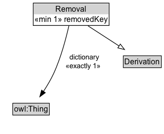

# Removal

## Diagram

=== "SVG (interactive)"

    <!-- Generated by graphviz version 14.0.2 (20251019.1705)
     -->
    <!-- Pages: 1 -->
    <svg width="253pt" height="206pt"
     viewBox="0.00 0.00 253.00 206.00" xmlns="http://www.w3.org/2000/svg" xmlns:xlink="http://www.w3.org/1999/xlink">
    <g id="graph0" class="graph" transform="scale(1 1) rotate(0) translate(4 202)">
    <polygon fill="white" stroke="none" points="-4,4 -4,-202 249.38,-202 249.38,4 -4,4"/>
    <g id="clust2" class="cluster">
    <title>cluster_associated</title>
    </g>
    <!-- Removal -->
    <g id="node1" class="node">
    <title>Removal</title>
    <g id="a_node1"><a xlink:href="../Removal" xlink:title="&lt;TABLE&gt;">
    <polygon fill="lightgray" stroke="none" points="48.38,-180 48.38,-196.25 163.62,-196.25 163.62,-180 48.38,-180"/>
    <text xml:space="preserve" text-anchor="start" x="82" y="-183.85" font-family="Arial" font-size="12.00">Removal</text>
    <text xml:space="preserve" text-anchor="start" x="49.38" y="-167.6" font-family="Arial" font-size="12.00">«min 1» removedKey</text>
    <polygon fill="none" stroke="black" points="47.38,-162.75 47.38,-197.25 164.62,-197.25 164.62,-162.75 47.38,-162.75"/>
    </a>
    </g>
    </g>
    <!-- Invis -->
    <!-- Removal&#45;&gt;Invis -->
    <!-- owl_Thing -->
    <g id="node3" class="node">
    <title>owl_Thing</title>
    <g id="a_node3"><a xlink:href="https://w3id.org/citydata/imported/owl/Thing" xlink:title="&lt;TABLE&gt;">
    <polygon fill="lightgray" stroke="none" points="16.75,-25.88 16.75,-42.12 71.25,-42.12 71.25,-25.88 16.75,-25.88"/>
    <text xml:space="preserve" text-anchor="start" x="17.75" y="-29.73" font-family="Arial" font-size="12.00">owl:Thing</text>
    <polygon fill="none" stroke="black" points="15.75,-24.88 15.75,-43.12 72.25,-43.12 72.25,-24.88 15.75,-24.88"/>
    </a>
    </g>
    </g>
    <!-- Removal&#45;&gt;owl_Thing -->
    <g id="edge4" class="edge">
    <title>Removal&#45;&gt;owl_Thing</title>
    <path fill="none" stroke="black" d="M102.47,-162.23C98.25,-143.76 90.3,-113.43 79,-89 74.62,-79.53 68.77,-69.77 63.11,-61.21"/>
    <polygon fill="black" stroke="black" points="66.05,-59.31 57.51,-53.04 60.28,-63.26 66.05,-59.31"/>
    <text xml:space="preserve" text-anchor="middle" x="126.08" y="-110.05" font-family="Arial" font-size="11.00"> dictionary </text>
    <text xml:space="preserve" text-anchor="middle" x="126.08" y="-96.55" font-family="Arial" font-size="11.00"> «exactly 1» &#160;</text>
    </g>
    <!-- Derivation -->
    <g id="node4" class="node">
    <title>Derivation</title>
    <g id="a_node4"><a xlink:href="../Derivation" xlink:title="&lt;TABLE&gt;">
    <polygon fill="lightgray" stroke="none" points="187.62,-98.88 187.62,-115.12 244.38,-115.12 244.38,-98.88 187.62,-98.88"/>
    <text xml:space="preserve" text-anchor="start" x="188.62" y="-102.72" font-family="Arial" font-size="12.00">Derivation</text>
    <polygon fill="none" stroke="black" points="186.62,-97.88 186.62,-116.12 245.38,-116.12 245.38,-97.88 186.62,-97.88"/>
    </a>
    </g>
    </g>
    <!-- Removal&#45;&gt;Derivation -->
    <g id="edge1" class="edge">
    <title>Removal&#45;&gt;Derivation</title>
    <path fill="none" stroke="black" d="M132.07,-162.17C146.48,-152.87 164.61,-141.17 180.32,-131.03"/>
    <polygon fill="none" stroke="black" points="181.96,-134.14 188.47,-125.77 178.17,-128.25 181.96,-134.14"/>
    </g>
    <!-- Invis&#45;&gt;owl_Thing -->
    </g>
    </svg>

=== "PNG"

    

## Formalization for Removal

| Property | Constraint |
|----------|------------|
| [dictionary](https://w3id.org/citydata/imported//dictionary) | exactly 1 |
| [removedKey](https://w3id.org/citydata/imported//removedKey) | min 1 |
| subClassOf | [Derivation](Derivation.md) |

## Other annotations

| Property | Value |
|----------|-------|
| [category](https://w3id.org/citydata/imported//category) | collections |
| [component](https://w3id.org/citydata/imported//component) | collections |
| [constraints](https://w3id.org/citydata/imported//constraints) | http://www.w3.org/TR/2013/NOTE-prov-dictionary-20130430/#dictionary-constraints |
| [definition](https://w3id.org/citydata/imported//definition) | Removal is a derivation that describes the transformation of a dictionary into another, by removing one or more keys. |
| [dm](https://w3id.org/citydata/imported//dm) | http://www.w3.org/TR/2013/NOTE-prov-dictionary-20130430/#term-dictionary-removal |
| [n](https://w3id.org/citydata/imported//n) | http://www.w3.org/TR/2013/NOTE-prov-dictionary-20130430/#expression-dictionary-removal |

