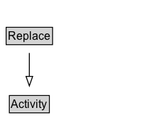

# Replace

## Diagram

=== "SVG (interactive)"

    <!-- Generated by graphviz version 14.0.2 (20251019.1705)
     -->
    <!-- Pages: 1 -->
    <svg width="150pt" height="132pt"
     viewBox="0.00 0.00 150.00 132.00" xmlns="http://www.w3.org/2000/svg" xmlns:xlink="http://www.w3.org/1999/xlink">
    <g id="graph0" class="graph" transform="scale(1 1) rotate(0) translate(4 128)">
    <polygon fill="white" stroke="none" points="-4,4 -4,-128 146,-128 146,4 -4,4"/>
    <g id="clust2" class="cluster">
    <title>cluster_associated</title>
    </g>
    <!-- Replace -->
    <g id="node1" class="node">
    <title>Replace</title>
    <g id="a_node1"><a xlink:href="../Replace" xlink:title="&lt;TABLE&gt;">
    <polygon fill="lightgray" stroke="none" points="3.5,-81.88 3.5,-98.12 50.5,-98.12 50.5,-81.88 3.5,-81.88"/>
    <text xml:space="preserve" text-anchor="start" x="4.5" y="-85.72" font-family="Arial" font-size="12.00">Replace</text>
    <polygon fill="none" stroke="black" points="2.5,-80.88 2.5,-99.12 51.5,-99.12 51.5,-80.88 2.5,-80.88"/>
    </a>
    </g>
    </g>
    <!-- Activity -->
    <g id="node3" class="node">
    <title>Activity</title>
    <g id="a_node3"><a xlink:href="../Activity" xlink:title="&lt;TABLE&gt;">
    <polygon fill="lightgray" stroke="none" points="6.88,-9.88 6.88,-26.12 47.12,-26.12 47.12,-9.88 6.88,-9.88"/>
    <text xml:space="preserve" text-anchor="start" x="7.88" y="-13.72" font-family="Arial" font-size="12.00">Activity</text>
    <polygon fill="none" stroke="black" points="5.88,-8.88 5.88,-27.12 48.12,-27.12 48.12,-8.88 5.88,-8.88"/>
    </a>
    </g>
    </g>
    <!-- Replace&#45;&gt;Activity -->
    <g id="edge1" class="edge">
    <title>Replace&#45;&gt;Activity</title>
    <path fill="none" stroke="black" d="M27,-72.05C27,-64.57 27,-55.58 27,-47.14"/>
    <polygon fill="none" stroke="black" points="30.5,-47.3 27,-37.3 23.5,-47.3 30.5,-47.3"/>
    </g>
    <!-- Invis -->
    </g>
    </svg>

=== "PNG"

    

## Formalization for Replace

| Property | Constraint |
|----------|------------|
| subClassOf | [Activity](Activity.md) |

## Other annotations

| Property | Value |
|----------|-------|
| [definition](https://w3id.org/citydata/imported//definition) | Activity that identifies the replacement of a resource. |

