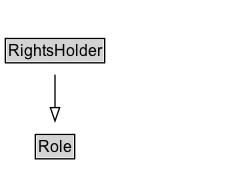

# RightsHolder

## Diagram

=== "SVG (interactive)"

    <!-- Generated by graphviz version 14.0.2 (20251019.1705)
     -->
    <!-- Pages: 1 -->
    <svg width="170pt" height="132pt"
     viewBox="0.00 0.00 170.00 132.00" xmlns="http://www.w3.org/2000/svg" xmlns:xlink="http://www.w3.org/1999/xlink">
    <g id="graph0" class="graph" transform="scale(1 1) rotate(0) translate(4 128)">
    <polygon fill="white" stroke="none" points="-4,4 -4,-128 166.25,-128 166.25,4 -4,4"/>
    <g id="clust2" class="cluster">
    <title>cluster_associated</title>
    </g>
    <!-- RightsHolder -->
    <g id="node1" class="node">
    <title>RightsHolder</title>
    <g id="a_node1"><a xlink:href="../RightsHolder" xlink:title="&lt;TABLE&gt;">
    <polygon fill="lightgray" stroke="none" points="1,-81.88 1,-98.12 73.5,-98.12 73.5,-81.88 1,-81.88"/>
    <text xml:space="preserve" text-anchor="start" x="2" y="-85.72" font-family="Arial" font-size="12.00">RightsHolder</text>
    <polygon fill="none" stroke="black" points="0,-80.88 0,-99.12 74.5,-99.12 74.5,-80.88 0,-80.88"/>
    </a>
    </g>
    </g>
    <!-- Role -->
    <g id="node3" class="node">
    <title>Role</title>
    <g id="a_node3"><a xlink:href="../Role" xlink:title="&lt;TABLE&gt;">
    <polygon fill="lightgray" stroke="none" points="23.5,-9.88 23.5,-26.12 51,-26.12 51,-9.88 23.5,-9.88"/>
    <text xml:space="preserve" text-anchor="start" x="24.5" y="-13.72" font-family="Arial" font-size="12.00">Role</text>
    <polygon fill="none" stroke="black" points="22.5,-8.88 22.5,-27.12 52,-27.12 52,-8.88 22.5,-8.88"/>
    </a>
    </g>
    </g>
    <!-- RightsHolder&#45;&gt;Role -->
    <g id="edge1" class="edge">
    <title>RightsHolder&#45;&gt;Role</title>
    <path fill="none" stroke="black" d="M37.25,-72.05C37.25,-64.57 37.25,-55.58 37.25,-47.14"/>
    <polygon fill="none" stroke="black" points="40.75,-47.3 37.25,-37.3 33.75,-47.3 40.75,-47.3"/>
    </g>
    <!-- Invis -->
    </g>
    </svg>

=== "PNG"

    

## Formalization for RightsHolder

| Property | Constraint |
|----------|------------|
| subClassOf | [Role](Role.md) |

## Other annotations

| Property | Value |
|----------|-------|
| [definition](https://w3id.org/citydata/imported//definition) | Role with the function of owning or managing rights over a resource. The Agent assigned to this role is associated with a RightsAssignment Activity |

