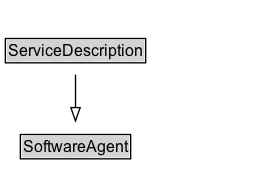

# ServiceDescription

## Diagram

=== "SVG (interactive)"

    <!-- Generated by graphviz version 14.0.2 (20251019.1705)
     -->
    <!-- Pages: 1 -->
    <svg width="202pt" height="132pt"
     viewBox="0.00 0.00 202.00 132.00" xmlns="http://www.w3.org/2000/svg" xmlns:xlink="http://www.w3.org/1999/xlink">
    <g id="graph0" class="graph" transform="scale(1 1) rotate(0) translate(4 128)">
    <polygon fill="white" stroke="none" points="-4,4 -4,-128 197.62,-128 197.62,4 -4,4"/>
    <g id="clust2" class="cluster">
    <title>cluster_associated</title>
    </g>
    <!-- ServiceDescription -->
    <g id="node1" class="node">
    <title>ServiceDescription</title>
    <g id="a_node1"><a xlink:href="../ServiceDescription" xlink:title="&lt;TABLE&gt;">
    <polygon fill="lightgray" stroke="none" points="1,-81.88 1,-98.12 104.25,-98.12 104.25,-81.88 1,-81.88"/>
    <text xml:space="preserve" text-anchor="start" x="2" y="-85.72" font-family="Arial" font-size="12.00">ServiceDescription</text>
    <polygon fill="none" stroke="black" points="0,-80.88 0,-99.12 105.25,-99.12 105.25,-80.88 0,-80.88"/>
    </a>
    </g>
    </g>
    <!-- SoftwareAgent -->
    <g id="node3" class="node">
    <title>SoftwareAgent</title>
    <g id="a_node3"><a xlink:href="../SoftwareAgent" xlink:title="&lt;TABLE&gt;">
    <polygon fill="lightgray" stroke="none" points="12.25,-9.88 12.25,-26.12 93,-26.12 93,-9.88 12.25,-9.88"/>
    <text xml:space="preserve" text-anchor="start" x="13.25" y="-13.72" font-family="Arial" font-size="12.00">SoftwareAgent</text>
    <polygon fill="none" stroke="black" points="11.25,-8.88 11.25,-27.12 94,-27.12 94,-8.88 11.25,-8.88"/>
    </a>
    </g>
    </g>
    <!-- ServiceDescription&#45;&gt;SoftwareAgent -->
    <g id="edge1" class="edge">
    <title>ServiceDescription&#45;&gt;SoftwareAgent</title>
    <path fill="none" stroke="black" d="M52.62,-72.05C52.62,-64.57 52.62,-55.58 52.62,-47.14"/>
    <polygon fill="none" stroke="black" points="56.13,-47.3 52.63,-37.3 49.13,-47.3 56.13,-47.3"/>
    </g>
    <!-- Invis -->
    </g>
    </svg>

=== "PNG"

    

## Formalization for ServiceDescription

| Property | Constraint |
|----------|------------|
| subClassOf | [SoftwareAgent](SoftwareAgent.md) |

## Other annotations

| Property | Value |
|----------|-------|
| [aq](https://w3id.org/citydata/imported//aq) | http://www.w3.org/TR/2013/NOTE-prov-aq-20130430/#provenance-query-service-discovery |
| [category](https://w3id.org/citydata/imported//category) | access-and-query |

