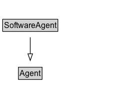

# SoftwareAgent

## Diagram

=== "SVG (interactive)"

    <!-- Generated by graphviz version 14.0.2 (20251019.1705)
     -->
    <!-- Pages: 1 -->
    <svg width="178pt" height="132pt"
     viewBox="0.00 0.00 178.00 132.00" xmlns="http://www.w3.org/2000/svg" xmlns:xlink="http://www.w3.org/1999/xlink">
    <g id="graph0" class="graph" transform="scale(1 1) rotate(0) translate(4 128)">
    <polygon fill="white" stroke="none" points="-4,4 -4,-128 174.38,-128 174.38,4 -4,4"/>
    <g id="clust2" class="cluster">
    <title>cluster_associated</title>
    </g>
    <!-- SoftwareAgent -->
    <g id="node1" class="node">
    <title>SoftwareAgent</title>
    <g id="a_node1"><a xlink:href="../SoftwareAgent" xlink:title="&lt;TABLE&gt;">
    <polygon fill="lightgray" stroke="none" points="1,-81.88 1,-98.12 81.75,-98.12 81.75,-81.88 1,-81.88"/>
    <text xml:space="preserve" text-anchor="start" x="2" y="-85.72" font-family="Arial" font-size="12.00">SoftwareAgent</text>
    <polygon fill="none" stroke="black" points="0,-80.88 0,-99.12 82.75,-99.12 82.75,-80.88 0,-80.88"/>
    </a>
    </g>
    </g>
    <!-- Agent -->
    <g id="node3" class="node">
    <title>Agent</title>
    <g id="a_node3"><a xlink:href="../Agent" xlink:title="&lt;TABLE&gt;">
    <polygon fill="lightgray" stroke="none" points="24.62,-9.88 24.62,-26.12 58.12,-26.12 58.12,-9.88 24.62,-9.88"/>
    <text xml:space="preserve" text-anchor="start" x="25.62" y="-13.72" font-family="Arial" font-size="12.00">Agent</text>
    <polygon fill="none" stroke="black" points="23.62,-8.88 23.62,-27.12 59.12,-27.12 59.12,-8.88 23.62,-8.88"/>
    </a>
    </g>
    </g>
    <!-- SoftwareAgent&#45;&gt;Agent -->
    <g id="edge1" class="edge">
    <title>SoftwareAgent&#45;&gt;Agent</title>
    <path fill="none" stroke="black" d="M41.38,-72.05C41.38,-64.57 41.38,-55.58 41.38,-47.14"/>
    <polygon fill="none" stroke="black" points="44.88,-47.3 41.38,-37.3 37.88,-47.3 44.88,-47.3"/>
    </g>
    <!-- Invis -->
    </g>
    </svg>

=== "PNG"

    

## Specializations of SoftwareAgent

| Class | Description |
|-------|-------------|
| [Provenance Service](DirectQueryService.md) |  |
| [Service Description](ServiceDescription.md) |  |

## Formalization for SoftwareAgent

| Property | Constraint |
|----------|------------|
| subClassOf | [Agent](Agent.md) |

## Other annotations

| Property | Value |
|----------|-------|
| [category](https://w3id.org/citydata/imported//category) | expanded |
| [component](https://w3id.org/citydata/imported//component) | agents-responsibility |
| [definition](https://w3id.org/citydata/imported//definition) | A software agent is running software. |
| [dm](https://w3id.org/citydata/imported//dm) | http://www.w3.org/TR/2013/REC-prov-dm-20130430/#term-agent |
| [dm](https://w3id.org/citydata/imported//dm) | http://www.w3.org/TR/2012/WD-prov-dm-20120703/prov-dm.html#term-agent |
| [n](https://w3id.org/citydata/imported//n) | http://www.w3.org/TR/2013/REC-prov-n-20130430/#expression-types |
| [n](https://w3id.org/citydata/imported//n) | http://www.w3.org/TR/2012/WD-prov-dm-20120703/prov-n.html#expression-types |

