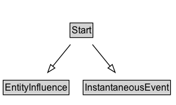

# Start

## Diagram

=== "SVG (interactive)"

    <!-- Generated by graphviz version 14.0.2 (20251019.1705)
     -->
    <!-- Pages: 1 -->
    <svg width="221pt" height="132pt"
     viewBox="0.00 0.00 221.00 132.00" xmlns="http://www.w3.org/2000/svg" xmlns:xlink="http://www.w3.org/1999/xlink">
    <g id="graph0" class="graph" transform="scale(1 1) rotate(0) translate(4 128)">
    <polygon fill="white" stroke="none" points="-4,4 -4,-128 217.38,-128 217.38,4 -4,4"/>
    <g id="clust2" class="cluster">
    <title>cluster_associated</title>
    </g>
    <!-- Start -->
    <g id="node1" class="node">
    <title>Start</title>
    <g id="a_node1"><a xlink:href="../Start" xlink:title="&lt;TABLE&gt;">
    <polygon fill="lightgray" stroke="none" points="85,-81.88 85,-98.12 111.75,-98.12 111.75,-81.88 85,-81.88"/>
    <text xml:space="preserve" text-anchor="start" x="86" y="-85.72" font-family="Arial" font-size="12.00">Start</text>
    <polygon fill="none" stroke="black" points="84,-80.88 84,-99.12 112.75,-99.12 112.75,-80.88 84,-80.88"/>
    </a>
    </g>
    </g>
    <!-- EntityInfluence -->
    <g id="node3" class="node">
    <title>EntityInfluence</title>
    <g id="a_node3"><a xlink:href="../EntityInfluence" xlink:title="&lt;TABLE&gt;">
    <polygon fill="lightgray" stroke="none" points="1,-9.88 1,-26.12 81.75,-26.12 81.75,-9.88 1,-9.88"/>
    <text xml:space="preserve" text-anchor="start" x="2" y="-13.72" font-family="Arial" font-size="12.00">EntityInfluence</text>
    <polygon fill="none" stroke="black" points="0,-8.88 0,-27.12 82.75,-27.12 82.75,-8.88 0,-8.88"/>
    </a>
    </g>
    </g>
    <!-- Start&#45;&gt;EntityInfluence -->
    <g id="edge1" class="edge">
    <title>Start&#45;&gt;EntityInfluence</title>
    <path fill="none" stroke="black" d="M84.58,-72.05C77.86,-63.8 69.63,-53.7 62.17,-44.54"/>
    <polygon fill="none" stroke="black" points="65.03,-42.51 56,-36.96 59.6,-46.93 65.03,-42.51"/>
    </g>
    <!-- InstantaneousEvent -->
    <g id="node4" class="node">
    <title>InstantaneousEvent</title>
    <g id="a_node4"><a xlink:href="../InstantaneousEvent" xlink:title="&lt;TABLE&gt;">
    <polygon fill="lightgray" stroke="none" points="101.5,-9.88 101.5,-26.12 209.25,-26.12 209.25,-9.88 101.5,-9.88"/>
    <text xml:space="preserve" text-anchor="start" x="102.5" y="-13.72" font-family="Arial" font-size="12.00">InstantaneousEvent</text>
    <polygon fill="none" stroke="black" points="100.5,-8.88 100.5,-27.12 210.25,-27.12 210.25,-8.88 100.5,-8.88"/>
    </a>
    </g>
    </g>
    <!-- Start&#45;&gt;InstantaneousEvent -->
    <g id="edge2" class="edge">
    <title>Start&#45;&gt;InstantaneousEvent</title>
    <path fill="none" stroke="black" d="M112.17,-72.05C118.89,-63.8 127.12,-53.7 134.58,-44.54"/>
    <polygon fill="none" stroke="black" points="137.15,-46.93 140.75,-36.96 131.72,-42.51 137.15,-46.93"/>
    </g>
    <!-- Invis -->
    </g>
    </svg>

=== "PNG"

    

## Formalization for Start

| Property | Constraint |
|----------|------------|
| subClassOf | [EntityInfluence](EntityInfluence.md) |
| subClassOf | [InstantaneousEvent](InstantaneousEvent.md) |

## Other annotations

| Property | Value |
|----------|-------|
| [category](https://w3id.org/citydata/imported//category) | qualified |
| [component](https://w3id.org/citydata/imported//component) | entities-activities |
| [constraints](https://w3id.org/citydata/imported//constraints) | http://www.w3.org/TR/2013/REC-prov-constraints-20130430/#prov-dm-constraints-fig |
| [definition](https://w3id.org/citydata/imported//definition) | Start is when an activity is deemed to have been started by an entity, known as trigger. The activity did not exist before its start. Any usage, generation, or invalidation involving an activity follows the activity's start. A start may refer to a trigger entity that set off the activity, or to an activity, known as starter, that generated the trigger. |
| [dm](https://w3id.org/citydata/imported//dm) | http://www.w3.org/TR/2013/REC-prov-dm-20130430/#term-Start |
| [n](https://w3id.org/citydata/imported//n) | http://www.w3.org/TR/2013/REC-prov-n-20130430/#expression-Start |

