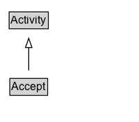

# Accept

Activity that identifies the acceptance of a resource (e.g., an article in a conference)

## Diagram

=== "SVG (interactive)"

    <!-- Generated by graphviz version 14.1.3 (20260303.0454)
     -->
    <!-- Pages: 1 -->
    <svg width="150pt" height="132pt"
     viewBox="0.00 0.00 150.00 132.00" xmlns="http://www.w3.org/2000/svg" xmlns:xlink="http://www.w3.org/1999/xlink">
    <g id="graph0" class="graph" transform="scale(1 1) rotate(0) translate(4 128)">
    <polygon fill="white" stroke="none" points="-4,4 -4,-128 146,-128 146,4 -4,4"/>
    <g id="clust3" class="cluster">
    <title>cluster_associated</title>
    </g>
    <!-- Activity -->
    <g id="node1" class="node">
    <title>Activity</title>
    <g id="a_node1"><a xlink:href="../Activity" xlink:title="&lt;TABLE&gt;">
    <polygon fill="lightgray" stroke="none" points="6.88,-97.88 6.88,-114.12 47.12,-114.12 47.12,-97.88 6.88,-97.88"/>
    <text xml:space="preserve" text-anchor="start" x="7.88" y="-101.88" font-family="Arial" font-size="12.00">Activity</text>
    <polygon fill="none" stroke="black" points="5.88,-96.88 5.88,-115.12 48.12,-115.12 48.12,-96.88 5.88,-96.88"/>
    </a>
    </g>
    </g>
    <!-- Accept -->
    <g id="node2" class="node">
    <title>Accept</title>
    <g id="a_node2"><a xlink:href="../Accept" xlink:title="&lt;TABLE&gt;">
    <polygon fill="lightgray" stroke="none" points="7.62,-25.88 7.62,-42.12 46.38,-42.12 46.38,-25.88 7.62,-25.88"/>
    <text xml:space="preserve" text-anchor="start" x="8.62" y="-29.88" font-family="Arial" font-size="12.00">Accept</text>
    <polygon fill="none" stroke="black" points="6.62,-24.88 6.62,-43.12 47.38,-43.12 47.38,-24.88 6.62,-24.88"/>
    </a>
    </g>
    </g>
    <!-- Accept&#45;&gt;Activity -->
    <g id="edge1" class="edge">
    <title>Accept&#45;&gt;Activity</title>
    <path fill="none" stroke="black" d="M27,-51.79C27,-59.25 27,-68.24 27,-76.69"/>
    <polygon fill="none" stroke="black" points="23.5,-76.54 27,-86.54 30.5,-76.54 23.5,-76.54"/>
    </g>
    <!-- Invis -->
    </g>
    </svg>

=== "PNG"

    

## Formalization for Accept

| Property | Constraint |
|----------|------------|
| subClassOf | [Activity](Activity.md) |

## Other annotations

| Property | Value |
|----------|-------|
| definition | Activity that identifies the acceptance of a resource (e.g., an article in a conference) |

