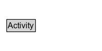

# Activity

An activity is something that occurs over a period of time and acts upon or with entities; it may include consuming, processing, transforming, modifying, relocating, using, or generating entities.

## Diagram

=== "SVG (interactive)"

    <!-- Generated by graphviz version 14.1.3 (20260303.0454)
     -->
    <!-- Pages: 1 -->
    <svg width="150pt" height="76pt"
     viewBox="0.00 0.00 150.00 76.00" xmlns="http://www.w3.org/2000/svg" xmlns:xlink="http://www.w3.org/1999/xlink">
    <g id="graph0" class="graph" transform="scale(1 1) rotate(0) translate(4 72)">
    <polygon fill="white" stroke="none" points="-4,4 -4,-72 146,-72 146,4 -4,4"/>
    <g id="clust3" class="cluster">
    <title>cluster_associated</title>
    </g>
    <!-- Activity -->
    <g id="node1" class="node">
    <title>Activity</title>
    <g id="a_node1"><a xlink:href="../Activity" xlink:title="&lt;TABLE&gt;">
    <polygon fill="lightgray" stroke="none" points="6.88,-25.88 6.88,-42.12 47.12,-42.12 47.12,-25.88 6.88,-25.88"/>
    <text xml:space="preserve" text-anchor="start" x="7.88" y="-29.88" font-family="Arial" font-size="12.00">Activity</text>
    <polygon fill="none" stroke="black" points="5.88,-24.88 5.88,-43.12 48.12,-43.12 48.12,-24.88 5.88,-24.88"/>
    </a>
    </g>
    </g>
    <!-- Invis -->
    </g>
    </svg>

=== "PNG"

    

## Specializations of Activity

| Class | Description |
|-------|-------------|
| [Accept](Accept.md) | Activity that identifies the acceptance of a resource (e.g., an article in a conference) |
| [Contribute](Contribute.md) | Activity that identifies any contribution of an agent to a resource.  |
| [Copyright](Copyright.md) | Activity that identifies the Copyrighting activity associated to a resource. |
| [Create](Create.md) | Activity that identifies the creation of a resource |
| [Modify](Modify.md) | Activity that identifies the modification of a resource.  |
| [Publish](Publish.md) | Activity that identifies the publication of a resource |
| [Replace](Replace.md) | Activity that identifies the replacement of a resource. |
| [Rights Assignment](RightsAssignment.md) | Activity that identifies the rights assignment of a resource. |
| [Submit](Submit.md) | Activity that identifies the issuance (e.g., publication) of a resource.  |

## Formalization for Activity

| Property | Constraint |
|----------|------------|
| disjointWith | [Entity](Entity.md) |

## Other annotations

| Property | Value |
|----------|-------|
| category | starting-point |
| component | entities-activities |
| constraints | http://www.w3.org/TR/2013/REC-prov-constraints-20130430/#prov-dm-constraints-fig |
| definition | An activity is something that occurs over a period of time and acts upon or with entities; it may include consuming, processing, transforming, modifying, relocating, using, or generating entities. |
| dm | http://www.w3.org/TR/2013/REC-prov-dm-20130430/#term-Activity |
| n | http://www.w3.org/TR/2013/REC-prov-n-20130430/#expression-Activity |

