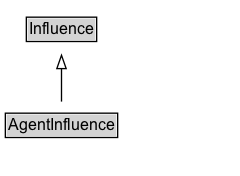

# AgentInfluence

AgentInfluence is the capacity of an agent to have an effect on the character, development, or behavior of another by means of attribution, association, delegation, or other.

## Diagram

=== "SVG (interactive)"

    <!-- Generated by graphviz version 14.1.3 (20260303.0454)
     -->
    <!-- Pages: 1 -->
    <svg width="180pt" height="132pt"
     viewBox="0.00 0.00 180.00 132.00" xmlns="http://www.w3.org/2000/svg" xmlns:xlink="http://www.w3.org/1999/xlink">
    <g id="graph0" class="graph" transform="scale(1 1) rotate(0) translate(4 128)">
    <polygon fill="white" stroke="none" points="-4,4 -4,-128 176.12,-128 176.12,4 -4,4"/>
    <g id="clust3" class="cluster">
    <title>cluster_associated</title>
    </g>
    <!-- Influence -->
    <g id="node1" class="node">
    <title>Influence</title>
    <g id="a_node1"><a xlink:href="../Influence" xlink:title="&lt;TABLE&gt;">
    <polygon fill="lightgray" stroke="none" points="16.75,-97.88 16.75,-114.12 67.5,-114.12 67.5,-97.88 16.75,-97.88"/>
    <text xml:space="preserve" text-anchor="start" x="17.75" y="-101.88" font-family="Arial" font-size="12.00">Influence</text>
    <polygon fill="none" stroke="black" points="15.75,-96.88 15.75,-115.12 68.5,-115.12 68.5,-96.88 15.75,-96.88"/>
    </a>
    </g>
    </g>
    <!-- AgentInfluence -->
    <g id="node2" class="node">
    <title>AgentInfluence</title>
    <g id="a_node2"><a xlink:href="../AgentInfluence" xlink:title="&lt;TABLE&gt;">
    <polygon fill="lightgray" stroke="none" points="1,-25.88 1,-42.12 83.25,-42.12 83.25,-25.88 1,-25.88"/>
    <text xml:space="preserve" text-anchor="start" x="2" y="-29.88" font-family="Arial" font-size="12.00">AgentInfluence</text>
    <polygon fill="none" stroke="black" points="0,-24.88 0,-43.12 84.25,-43.12 84.25,-24.88 0,-24.88"/>
    </a>
    </g>
    </g>
    <!-- AgentInfluence&#45;&gt;Influence -->
    <g id="edge1" class="edge">
    <title>AgentInfluence&#45;&gt;Influence</title>
    <path fill="none" stroke="black" d="M42.12,-51.79C42.12,-59.25 42.12,-68.24 42.12,-76.69"/>
    <polygon fill="none" stroke="black" points="38.63,-76.54 42.13,-86.54 45.63,-76.54 38.63,-76.54"/>
    </g>
    <!-- Invis -->
    </g>
    </svg>

=== "PNG"

    

## Specializations of AgentInfluence

| Class | Description |
|-------|-------------|
| [Association](Association.md) | An activity association is an assignment of responsibility to an agent for an activity, indicating that the agent had a role in the activity. It further allows for a plan to be specified, which is the plan intended by the agent to achieve some goals in the context of this activity. |
| [Attribution](Attribution.md) | Attribution is the ascribing of an entity to an agent.

When an entity e is attributed to agent ag, entity e was generated by some unspecified activity that in turn was associated to agent ag. Thus, this relation is useful when the activity is not known, or irrelevant. |
| [Delegation](Delegation.md) | Delegation is the assignment of authority and responsibility to an agent (by itself or by another agent) to carry out a specific activity as a delegate or representative, while the agent it acts on behalf of retains some responsibility for the outcome of the delegated work.

For example, a student acted on behalf of his supervisor, who acted on behalf of the department chair, who acted on behalf of the university; all those agents are responsible in some way for the activity that took place but we do not say explicitly who bears responsibility and to what degree. |

## Formalization for AgentInfluence

| Property | Constraint |
|----------|------------|
| subClassOf | [Influence](Influence.md) |

## Other annotations

| Property | Value |
|----------|-------|
| category | qualified |
| editorsDefinition | AgentInfluence is the capacity of an agent to have an effect on the character, development, or behavior of another by means of attribution, association, delegation, or other. |

