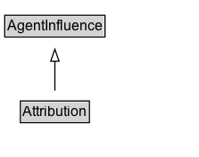

# Attribution

Attribution is the ascribing of an entity to an agent.

When an entity e is attributed to agent ag, entity e was generated by some unspecified activity that in turn was associated to agent ag. Thus, this relation is useful when the activity is not known, or irrelevant.

## Diagram

=== "SVG (interactive)"

    <!-- Generated by graphviz version 14.1.3 (20260303.0454)
     -->
    <!-- Pages: 1 -->
    <svg width="167pt" height="132pt"
     viewBox="0.00 0.00 167.00 132.00" xmlns="http://www.w3.org/2000/svg" xmlns:xlink="http://www.w3.org/1999/xlink">
    <g id="graph0" class="graph" transform="scale(1 1) rotate(0) translate(4 128)">
    <polygon fill="white" stroke="none" points="-4,4 -4,-128 163.12,-128 163.12,4 -4,4"/>
    <g id="clust3" class="cluster">
    <title>cluster_associated</title>
    </g>
    <!-- AgentInfluence -->
    <g id="node1" class="node">
    <title>AgentInfluence</title>
    <g id="a_node1"><a xlink:href="../AgentInfluence" xlink:title="&lt;TABLE&gt;">
    <polygon fill="lightgray" stroke="none" points="1,-97.88 1,-114.12 83.25,-114.12 83.25,-97.88 1,-97.88"/>
    <text xml:space="preserve" text-anchor="start" x="2" y="-101.88" font-family="Arial" font-size="12.00">AgentInfluence</text>
    <polygon fill="none" stroke="black" points="0,-96.88 0,-115.12 84.25,-115.12 84.25,-96.88 0,-96.88"/>
    </a>
    </g>
    </g>
    <!-- Attribution -->
    <g id="node2" class="node">
    <title>Attribution</title>
    <g id="a_node2"><a xlink:href="../Attribution" xlink:title="&lt;TABLE&gt;">
    <polygon fill="lightgray" stroke="none" points="14.12,-25.88 14.12,-42.12 70.12,-42.12 70.12,-25.88 14.12,-25.88"/>
    <text xml:space="preserve" text-anchor="start" x="15.12" y="-29.88" font-family="Arial" font-size="12.00">Attribution</text>
    <polygon fill="none" stroke="black" points="13.12,-24.88 13.12,-43.12 71.12,-43.12 71.12,-24.88 13.12,-24.88"/>
    </a>
    </g>
    </g>
    <!-- Attribution&#45;&gt;AgentInfluence -->
    <g id="edge1" class="edge">
    <title>Attribution&#45;&gt;AgentInfluence</title>
    <path fill="none" stroke="black" d="M42.12,-51.79C42.12,-59.25 42.12,-68.24 42.12,-76.69"/>
    <polygon fill="none" stroke="black" points="38.63,-76.54 42.13,-86.54 45.63,-76.54 38.63,-76.54"/>
    </g>
    <!-- Invis -->
    </g>
    </svg>

=== "PNG"

    

## Formalization for Attribution

| Property | Constraint |
|----------|------------|
| subClassOf | [AgentInfluence](AgentInfluence.md) |

## Other annotations

| Property | Value |
|----------|-------|
| category | qualified |
| component | agents-responsibility |
| constraints | http://www.w3.org/TR/2013/REC-prov-constraints-20130430/#prov-dm-constraints-fig |
| definition | Attribution is the ascribing of an entity to an agent.

When an entity e is attributed to agent ag, entity e was generated by some unspecified activity that in turn was associated to agent ag. Thus, this relation is useful when the activity is not known, or irrelevant. |
| dm | http://www.w3.org/TR/2013/REC-prov-dm-20130430/#term-attribution |
| n | http://www.w3.org/TR/2013/REC-prov-n-20130430/#expression-attribution |

