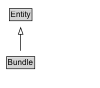

# Bundle

A bundle is a named set of provenance descriptions, and is itself an Entity, so allowing provenance of provenance to be expressed.

## Diagram

=== "SVG (interactive)"

    <!-- Generated by graphviz version 14.1.3 (20260303.0454)
     -->
    <!-- Pages: 1 -->
    <svg width="150pt" height="132pt"
     viewBox="0.00 0.00 150.00 132.00" xmlns="http://www.w3.org/2000/svg" xmlns:xlink="http://www.w3.org/1999/xlink">
    <g id="graph0" class="graph" transform="scale(1 1) rotate(0) translate(4 128)">
    <polygon fill="white" stroke="none" points="-4,4 -4,-128 146,-128 146,4 -4,4"/>
    <g id="clust3" class="cluster">
    <title>cluster_associated</title>
    </g>
    <!-- Entity -->
    <g id="node1" class="node">
    <title>Entity</title>
    <g id="a_node1"><a xlink:href="../Entity" xlink:title="&lt;TABLE&gt;">
    <polygon fill="lightgray" stroke="none" points="11,-97.88 11,-114.12 43,-114.12 43,-97.88 11,-97.88"/>
    <text xml:space="preserve" text-anchor="start" x="12" y="-101.88" font-family="Arial" font-size="12.00">Entity</text>
    <polygon fill="none" stroke="black" points="10,-96.88 10,-115.12 44,-115.12 44,-96.88 10,-96.88"/>
    </a>
    </g>
    </g>
    <!-- Bundle -->
    <g id="node2" class="node">
    <title>Bundle</title>
    <g id="a_node2"><a xlink:href="../Bundle" xlink:title="&lt;TABLE&gt;">
    <polygon fill="lightgray" stroke="none" points="6.88,-25.88 6.88,-42.12 47.12,-42.12 47.12,-25.88 6.88,-25.88"/>
    <text xml:space="preserve" text-anchor="start" x="7.88" y="-29.88" font-family="Arial" font-size="12.00">Bundle</text>
    <polygon fill="none" stroke="black" points="5.88,-24.88 5.88,-43.12 48.12,-43.12 48.12,-24.88 5.88,-24.88"/>
    </a>
    </g>
    </g>
    <!-- Bundle&#45;&gt;Entity -->
    <g id="edge1" class="edge">
    <title>Bundle&#45;&gt;Entity</title>
    <path fill="none" stroke="black" d="M27,-51.79C27,-59.25 27,-68.24 27,-76.69"/>
    <polygon fill="none" stroke="black" points="23.5,-76.54 27,-86.54 30.5,-76.54 23.5,-76.54"/>
    </g>
    <!-- Invis -->
    </g>
    </svg>

=== "PNG"

    

## Formalization for Bundle

| Property | Constraint |
|----------|------------|
| subClassOf | [Entity](Entity.md) |

## Other annotations

| Property | Value |
|----------|-------|
| category | expanded |
| definition | A bundle is a named set of provenance descriptions, and is itself an Entity, so allowing provenance of provenance to be expressed. |
| dm | http://www.w3.org/TR/2013/REC-prov-dm-20130430/#term-bundle-entity |
| n | http://www.w3.org/TR/2013/REC-prov-n-20130430/#expression-bundle-declaration |

