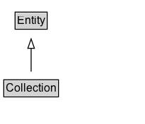

# Collection

A collection is an entity that provides a structure to some constituents, which are themselves entities. These constituents are said to be member of the collections.

## Diagram

=== "SVG (interactive)"

    <!-- Generated by graphviz version 14.1.3 (20260303.0454)
     -->
    <!-- Pages: 1 -->
    <svg width="154pt" height="132pt"
     viewBox="0.00 0.00 154.00 132.00" xmlns="http://www.w3.org/2000/svg" xmlns:xlink="http://www.w3.org/1999/xlink">
    <g id="graph0" class="graph" transform="scale(1 1) rotate(0) translate(4 128)">
    <polygon fill="white" stroke="none" points="-4,4 -4,-128 150,-128 150,4 -4,4"/>
    <g id="clust3" class="cluster">
    <title>cluster_associated</title>
    </g>
    <!-- Entity -->
    <g id="node1" class="node">
    <title>Entity</title>
    <g id="a_node1"><a xlink:href="../Entity" xlink:title="&lt;TABLE&gt;">
    <polygon fill="lightgray" stroke="none" points="13,-97.88 13,-114.12 45,-114.12 45,-97.88 13,-97.88"/>
    <text xml:space="preserve" text-anchor="start" x="14" y="-101.88" font-family="Arial" font-size="12.00">Entity</text>
    <polygon fill="none" stroke="black" points="12,-96.88 12,-115.12 46,-115.12 46,-96.88 12,-96.88"/>
    </a>
    </g>
    </g>
    <!-- Collection -->
    <g id="node2" class="node">
    <title>Collection</title>
    <g id="a_node2"><a xlink:href="../Collection" xlink:title="&lt;TABLE&gt;">
    <polygon fill="lightgray" stroke="none" points="1,-25.88 1,-42.12 57,-42.12 57,-25.88 1,-25.88"/>
    <text xml:space="preserve" text-anchor="start" x="2" y="-29.88" font-family="Arial" font-size="12.00">Collection</text>
    <polygon fill="none" stroke="black" points="0,-24.88 0,-43.12 58,-43.12 58,-24.88 0,-24.88"/>
    </a>
    </g>
    </g>
    <!-- Collection&#45;&gt;Entity -->
    <g id="edge1" class="edge">
    <title>Collection&#45;&gt;Entity</title>
    <path fill="none" stroke="black" d="M29,-51.79C29,-59.25 29,-68.24 29,-76.69"/>
    <polygon fill="none" stroke="black" points="25.5,-76.54 29,-86.54 32.5,-76.54 25.5,-76.54"/>
    </g>
    <!-- Invis -->
    </g>
    </svg>

=== "PNG"

    

## Specializations of Collection

| Class | Description |
|-------|-------------|
| [Empty Dictionary](EmptyDictionary.md) | An empty dictionary (i.e. has no members). |
| [Empty Collection](EmptyCollection.md) | An empty collection is a collection without members. |

## Formalization for Collection

| Property | Constraint |
|----------|------------|
| subClassOf | [Entity](Entity.md) |

## Other annotations

| Property | Value |
|----------|-------|
| category | expanded |
| component | collections |
| definition | A collection is an entity that provides a structure to some constituents, which are themselves entities. These constituents are said to be member of the collections. |
| dm | http://www.w3.org/TR/2013/REC-prov-dm-20130430/#term-collection |

