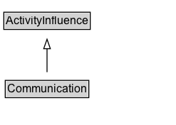

# Communication

Communication is the exchange of an entity by two activities, one activity using the entity generated by the other.

## Diagram

=== "SVG (interactive)"

    <!-- Generated by graphviz version 14.1.3 (20260303.0454)
     -->
    <!-- Pages: 1 -->
    <svg width="186pt" height="132pt"
     viewBox="0.00 0.00 186.00 132.00" xmlns="http://www.w3.org/2000/svg" xmlns:xlink="http://www.w3.org/1999/xlink">
    <g id="graph0" class="graph" transform="scale(1 1) rotate(0) translate(4 128)">
    <polygon fill="white" stroke="none" points="-4,4 -4,-128 181.5,-128 181.5,4 -4,4"/>
    <g id="clust3" class="cluster">
    <title>cluster_associated</title>
    </g>
    <!-- ActivityInfluence -->
    <g id="node1" class="node">
    <title>ActivityInfluence</title>
    <g id="a_node1"><a xlink:href="../ActivityInfluence" xlink:title="&lt;TABLE&gt;">
    <polygon fill="lightgray" stroke="none" points="1,-97.88 1,-114.12 90,-114.12 90,-97.88 1,-97.88"/>
    <text xml:space="preserve" text-anchor="start" x="2" y="-101.88" font-family="Arial" font-size="12.00">ActivityInfluence</text>
    <polygon fill="none" stroke="black" points="0,-96.88 0,-115.12 91,-115.12 91,-96.88 0,-96.88"/>
    </a>
    </g>
    </g>
    <!-- Communication -->
    <g id="node2" class="node">
    <title>Communication</title>
    <g id="a_node2"><a xlink:href="../Communication" xlink:title="&lt;TABLE&gt;">
    <polygon fill="lightgray" stroke="none" points="2.5,-25.88 2.5,-42.12 88.5,-42.12 88.5,-25.88 2.5,-25.88"/>
    <text xml:space="preserve" text-anchor="start" x="3.5" y="-29.88" font-family="Arial" font-size="12.00">Communication</text>
    <polygon fill="none" stroke="black" points="1.5,-24.88 1.5,-43.12 89.5,-43.12 89.5,-24.88 1.5,-24.88"/>
    </a>
    </g>
    </g>
    <!-- Communication&#45;&gt;ActivityInfluence -->
    <g id="edge1" class="edge">
    <title>Communication&#45;&gt;ActivityInfluence</title>
    <path fill="none" stroke="black" d="M45.5,-51.79C45.5,-59.25 45.5,-68.24 45.5,-76.69"/>
    <polygon fill="none" stroke="black" points="42,-76.54 45.5,-86.54 49,-76.54 42,-76.54"/>
    </g>
    <!-- Invis -->
    </g>
    </svg>

=== "PNG"

    

## Formalization for Communication

| Property | Constraint |
|----------|------------|
| subClassOf | [ActivityInfluence](ActivityInfluence.md) |

## Other annotations

| Property | Value |
|----------|-------|
| category | qualified |
| component | entities-activities |
| constraints | http://www.w3.org/TR/2013/REC-prov-constraints-20130430/#prov-dm-constraints-fig |
| definition | Communication is the exchange of an entity by two activities, one activity using the entity generated by the other. |
| dm | http://www.w3.org/TR/2013/REC-prov-dm-20130430/#term-Communication |
| n | http://www.w3.org/TR/2013/REC-prov-n-20130430/#expression-wasInformedBy |

