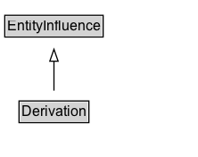

# Derivation

A derivation is a transformation of an entity into another, an update of an entity resulting in a new one, or the construction of a new entity based on a pre-existing entity.

## Diagram

=== "SVG (interactive)"

    <!-- Generated by graphviz version 14.1.3 (20260303.0454)
     -->
    <!-- Pages: 1 -->
    <svg width="166pt" height="132pt"
     viewBox="0.00 0.00 166.00 132.00" xmlns="http://www.w3.org/2000/svg" xmlns:xlink="http://www.w3.org/1999/xlink">
    <g id="graph0" class="graph" transform="scale(1 1) rotate(0) translate(4 128)">
    <polygon fill="white" stroke="none" points="-4,4 -4,-128 162.38,-128 162.38,4 -4,4"/>
    <g id="clust3" class="cluster">
    <title>cluster_associated</title>
    </g>
    <!-- EntityInfluence -->
    <g id="node1" class="node">
    <title>EntityInfluence</title>
    <g id="a_node1"><a xlink:href="../EntityInfluence" xlink:title="&lt;TABLE&gt;">
    <polygon fill="lightgray" stroke="none" points="1,-97.88 1,-114.12 81.75,-114.12 81.75,-97.88 1,-97.88"/>
    <text xml:space="preserve" text-anchor="start" x="2" y="-101.88" font-family="Arial" font-size="12.00">EntityInfluence</text>
    <polygon fill="none" stroke="black" points="0,-96.88 0,-115.12 82.75,-115.12 82.75,-96.88 0,-96.88"/>
    </a>
    </g>
    </g>
    <!-- Derivation -->
    <g id="node2" class="node">
    <title>Derivation</title>
    <g id="a_node2"><a xlink:href="../Derivation" xlink:title="&lt;TABLE&gt;">
    <polygon fill="lightgray" stroke="none" points="13,-25.88 13,-42.12 69.75,-42.12 69.75,-25.88 13,-25.88"/>
    <text xml:space="preserve" text-anchor="start" x="14" y="-29.88" font-family="Arial" font-size="12.00">Derivation</text>
    <polygon fill="none" stroke="black" points="12,-24.88 12,-43.12 70.75,-43.12 70.75,-24.88 12,-24.88"/>
    </a>
    </g>
    </g>
    <!-- Derivation&#45;&gt;EntityInfluence -->
    <g id="edge1" class="edge">
    <title>Derivation&#45;&gt;EntityInfluence</title>
    <path fill="none" stroke="black" d="M41.38,-51.79C41.38,-59.25 41.38,-68.24 41.38,-76.69"/>
    <polygon fill="none" stroke="black" points="37.88,-76.54 41.38,-86.54 44.88,-76.54 37.88,-76.54"/>
    </g>
    <!-- Invis -->
    </g>
    </svg>

=== "PNG"

    

## Specializations of Derivation

| Class | Description |
|-------|-------------|
| [Insertion](Insertion.md) | Insertion is a derivation that describes the transformation of a dictionary into another, by insertion of one or more key-entity pairs. |
| [Primary Source](PrimarySource.md) | A primary source for a topic refers to something produced by some agent with direct experience and knowledge about the topic, at the time of the topic's study, without benefit from hindsight.

Because of the directness of primary sources, they 'speak for themselves' in ways that cannot be captured through the filter of secondary sources. As such, it is important for secondary sources to reference those primary sources from which they were derived, so that their reliability can be investigated.

A primary source relation is a particular case of derivation of secondary materials from their primary sources. It is recognized that the determination of primary sources can be up to interpretation, and should be done according to conventions accepted within the application's domain. |
| [Quotation](Quotation.md) | A quotation is the repeat of (some or all of) an entity, such as text or image, by someone who may or may not be its original author. Quotation is a particular case of derivation. |
| [Removal](Removal.md) | Removal is a derivation that describes the transformation of a dictionary into another, by removing one or more keys. |
| [Revision](Revision.md) | A revision is a derivation for which the resulting entity is a revised version of some original. The implication here is that the resulting entity contains substantial content from the original. Revision is a particular case of derivation. |

## Formalization for Derivation

| Property | Constraint |
|----------|------------|
| subClassOf | [EntityInfluence](EntityInfluence.md) |

## Other annotations

| Property | Value |
|----------|-------|
| category | qualified |
| component | derivations |
| constraints | http://www.w3.org/TR/2013/REC-prov-constraints-20130430/#prov-dm-constraints-fig |
| definition | A derivation is a transformation of an entity into another, an update of an entity resulting in a new one, or the construction of a new entity based on a pre-existing entity. |
| dm | http://www.w3.org/TR/2013/REC-prov-dm-20130430/#term-Derivation |
| n | http://www.w3.org/TR/2013/REC-prov-n-20130430/#Derivation-Relation |

