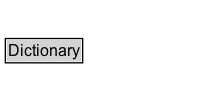

# Dictionary

A dictionary is an entity that provides a structure to some constituents, which are themselves entities. These constituents are said to be member of the dictionary.

## Diagram

=== "SVG (interactive)"

    <!-- Generated by graphviz version 14.1.3 (20260303.0454)
     -->
    <!-- Pages: 1 -->
    <svg width="154pt" height="76pt"
     viewBox="0.00 0.00 154.00 76.00" xmlns="http://www.w3.org/2000/svg" xmlns:xlink="http://www.w3.org/1999/xlink">
    <g id="graph0" class="graph" transform="scale(1 1) rotate(0) translate(4 72)">
    <polygon fill="white" stroke="none" points="-4,4 -4,-72 150,-72 150,4 -4,4"/>
    <g id="clust3" class="cluster">
    <title>cluster_associated</title>
    </g>
    <!-- Dictionary -->
    <g id="node1" class="node">
    <title>Dictionary</title>
    <g id="a_node1"><a xlink:href="../Dictionary" xlink:title="&lt;TABLE&gt;">
    <polygon fill="lightgray" stroke="none" points="1,-25.88 1,-42.12 57,-42.12 57,-25.88 1,-25.88"/>
    <text xml:space="preserve" text-anchor="start" x="2" y="-29.88" font-family="Arial" font-size="12.00">Dictionary</text>
    <polygon fill="none" stroke="black" points="0,-24.88 0,-43.12 58,-43.12 58,-24.88 0,-24.88"/>
    </a>
    </g>
    </g>
    <!-- Invis -->
    </g>
    </svg>

=== "PNG"

    

## Specializations of Dictionary

| Class | Description |
|-------|-------------|
| [Empty Dictionary](EmptyDictionary.md) | An empty dictionary (i.e. has no members). |

## Other annotations

| Property | Value |
|----------|-------|
| category | collections |
| component | collections |
| constraints | http://www.w3.org/TR/2013/NOTE-prov-dictionary-20130430/#dictionary-constraints |
| definition | A dictionary is an entity that provides a structure to some constituents, which are themselves entities. These constituents are said to be member of the dictionary. |
| dm | http://www.w3.org/TR/2013/NOTE-prov-dictionary-20130430/#dictionary-conceptual-definition |
| n | http://www.w3.org/TR/2013/NOTE-prov-dictionary-20130430/#expression-dictionary |

