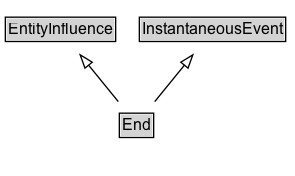

# End

End is when an activity is deemed to have been ended by an entity, known as trigger. The activity no longer exists after its end. Any usage, generation, or invalidation involving an activity precedes the activity's end. An end may refer to a trigger entity that terminated the activity, or to an activity, known as ender that generated the trigger.

## Diagram

=== "SVG (interactive)"

    <!-- Generated by graphviz version 14.1.3 (20260303.0454)
     -->
    <!-- Pages: 1 -->
    <svg width="221pt" height="132pt"
     viewBox="0.00 0.00 221.00 132.00" xmlns="http://www.w3.org/2000/svg" xmlns:xlink="http://www.w3.org/1999/xlink">
    <g id="graph0" class="graph" transform="scale(1 1) rotate(0) translate(4 128)">
    <polygon fill="white" stroke="none" points="-4,4 -4,-128 217.38,-128 217.38,4 -4,4"/>
    <g id="clust3" class="cluster">
    <title>cluster_associated</title>
    </g>
    <!-- EntityInfluence -->
    <g id="node1" class="node">
    <title>EntityInfluence</title>
    <g id="a_node1"><a xlink:href="../EntityInfluence" xlink:title="&lt;TABLE&gt;">
    <polygon fill="lightgray" stroke="none" points="1,-97.88 1,-114.12 81.75,-114.12 81.75,-97.88 1,-97.88"/>
    <text xml:space="preserve" text-anchor="start" x="2" y="-101.88" font-family="Arial" font-size="12.00">EntityInfluence</text>
    <polygon fill="none" stroke="black" points="0,-96.88 0,-115.12 82.75,-115.12 82.75,-96.88 0,-96.88"/>
    </a>
    </g>
    </g>
    <!-- InstantaneousEvent -->
    <g id="node2" class="node">
    <title>InstantaneousEvent</title>
    <g id="a_node2"><a xlink:href="../InstantaneousEvent" xlink:title="&lt;TABLE&gt;">
    <polygon fill="lightgray" stroke="none" points="101.5,-97.88 101.5,-114.12 209.25,-114.12 209.25,-97.88 101.5,-97.88"/>
    <text xml:space="preserve" text-anchor="start" x="102.5" y="-101.88" font-family="Arial" font-size="12.00">InstantaneousEvent</text>
    <polygon fill="none" stroke="black" points="100.5,-96.88 100.5,-115.12 210.25,-115.12 210.25,-96.88 100.5,-96.88"/>
    </a>
    </g>
    </g>
    <!-- End -->
    <g id="node3" class="node">
    <title>End</title>
    <g id="a_node3"><a xlink:href="../End" xlink:title="&lt;TABLE&gt;">
    <polygon fill="lightgray" stroke="none" points="86.5,-25.88 86.5,-42.12 110.25,-42.12 110.25,-25.88 86.5,-25.88"/>
    <text xml:space="preserve" text-anchor="start" x="87.5" y="-29.88" font-family="Arial" font-size="12.00">End</text>
    <polygon fill="none" stroke="black" points="85.5,-24.88 85.5,-43.12 111.25,-43.12 111.25,-24.88 85.5,-24.88"/>
    </a>
    </g>
    </g>
    <!-- End&#45;&gt;EntityInfluence -->
    <g id="edge1" class="edge">
    <title>End&#45;&gt;EntityInfluence</title>
    <path fill="none" stroke="black" d="M84.7,-51.79C78,-60.02 69.78,-70.11 62.31,-79.29"/>
    <polygon fill="none" stroke="black" points="59.73,-76.92 56.13,-86.88 65.16,-81.34 59.73,-76.92"/>
    </g>
    <!-- End&#45;&gt;InstantaneousEvent -->
    <g id="edge2" class="edge">
    <title>End&#45;&gt;InstantaneousEvent</title>
    <path fill="none" stroke="black" d="M112.05,-51.79C118.75,-60.02 126.97,-70.11 134.44,-79.29"/>
    <polygon fill="none" stroke="black" points="131.59,-81.34 140.62,-86.88 137.02,-76.92 131.59,-81.34"/>
    </g>
    <!-- Invis -->
    </g>
    </svg>

=== "PNG"

    

## Formalization for End

| Property | Constraint |
|----------|------------|
| subClassOf | [EntityInfluence](EntityInfluence.md) |
| subClassOf | [InstantaneousEvent](InstantaneousEvent.md) |

## Other annotations

| Property | Value |
|----------|-------|
| category | qualified |
| component | entities-activities |
| constraints | http://www.w3.org/TR/2013/REC-prov-constraints-20130430/#prov-dm-constraints-fig |
| definition | End is when an activity is deemed to have been ended by an entity, known as trigger. The activity no longer exists after its end. Any usage, generation, or invalidation involving an activity precedes the activity's end. An end may refer to a trigger entity that terminated the activity, or to an activity, known as ender that generated the trigger. |
| dm | http://www.w3.org/TR/2013/REC-prov-dm-20130430/#term-End |
| n | http://www.w3.org/TR/2013/REC-prov-n-20130430/#expression-End |

