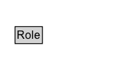

# Role

A role is the function of an entity or agent with respect to an activity, in the context of a usage, generation, invalidation, association, start, and end.

## Diagram

=== "SVG (interactive)"

    <!-- Generated by graphviz version 14.1.3 (20260303.0454)
     -->
    <!-- Pages: 1 -->
    <svg width="150pt" height="76pt"
     viewBox="0.00 0.00 150.00 76.00" xmlns="http://www.w3.org/2000/svg" xmlns:xlink="http://www.w3.org/1999/xlink">
    <g id="graph0" class="graph" transform="scale(1 1) rotate(0) translate(4 72)">
    <polygon fill="white" stroke="none" points="-4,4 -4,-72 146,-72 146,4 -4,4"/>
    <g id="clust3" class="cluster">
    <title>cluster_associated</title>
    </g>
    <!-- Role -->
    <g id="node1" class="node">
    <title>Role</title>
    <g id="a_node1"><a xlink:href="../Role" xlink:title="&lt;TABLE&gt;">
    <polygon fill="lightgray" stroke="none" points="13.25,-25.88 13.25,-42.12 40.75,-42.12 40.75,-25.88 13.25,-25.88"/>
    <text xml:space="preserve" text-anchor="start" x="14.25" y="-29.88" font-family="Arial" font-size="12.00">Role</text>
    <polygon fill="none" stroke="black" points="12.25,-24.88 12.25,-43.12 41.75,-43.12 41.75,-24.88 12.25,-24.88"/>
    </a>
    </g>
    </g>
    <!-- Invis -->
    </g>
    </svg>

=== "PNG"

    

## Specializations of Role

| Class | Description |
|-------|-------------|
| [Contributor](Contributor.md) | Role with the function of having responsibility for making contributions to a resource. The Agent assigned to this role is associated with a Modify or Create Activities |
| [Creator](Creator.md) | Role with the function of creating a resource. The Agent assigned to this role is associated with a Create Activity |
| [Publisher](Publisher.md) | Role with the function of publishing a resource. The Agent assigned to this role is associated with a Publish Activity |
| [Rights Holder](RightsHolder.md) | Role with the function of owning or managing rights over a resource. The Agent assigned to this role is associated with a RightsAssignment Activity |

## Other annotations

| Property | Value |
|----------|-------|
| category | qualified |
| component | agents-responsibility |
| definition | A role is the function of an entity or agent with respect to an activity, in the context of a usage, generation, invalidation, association, start, and end. |
| dm | http://www.w3.org/TR/2013/REC-prov-dm-20130430/#term-attribute-role |
| n | http://www.w3.org/TR/2013/REC-prov-n-20130430/#expression-attribute |

